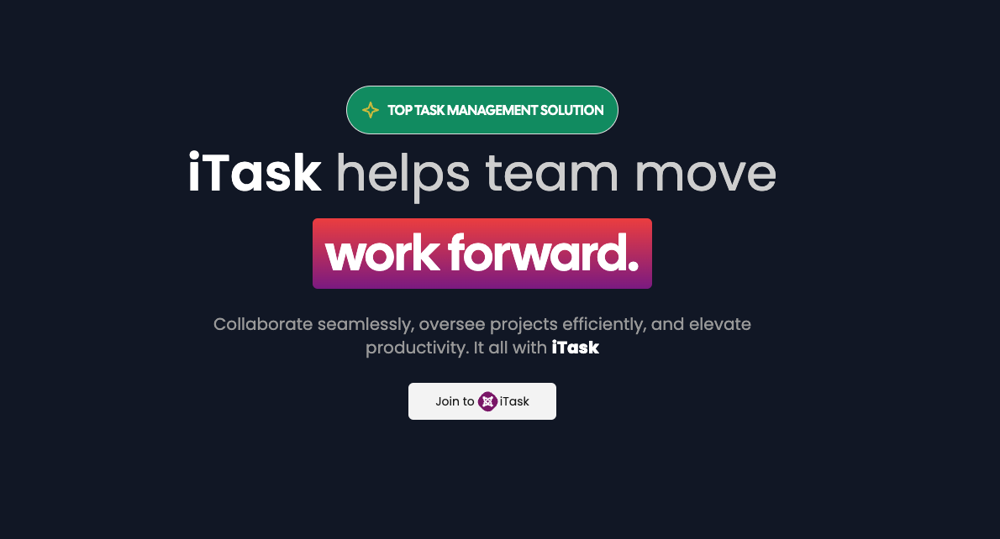
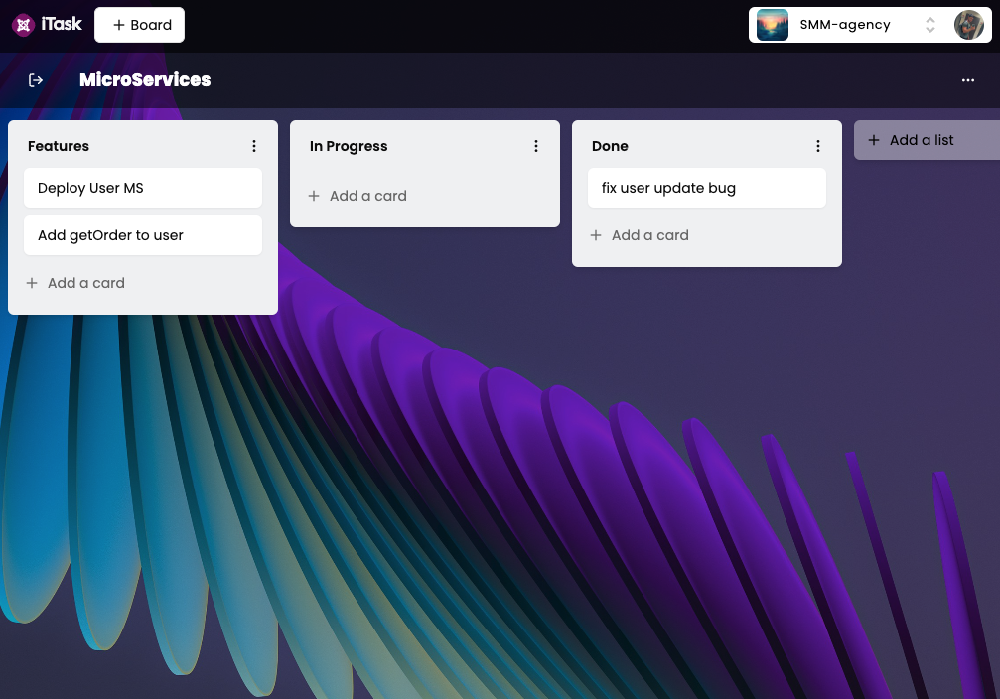
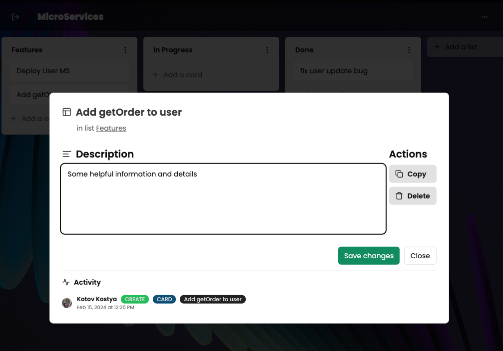

# Task Manager Project - iTask

This is a task management application built with Next.js. It is designed to help individuals and teams organize, track, and prioritize their tasks effectively.

## Features

- Create, edit, and delete tasks
- Organize tasks into projects and categories
- Collaborative features for team-based task management

## Screenshots

## Getting Started

To get started with this project, follow these steps:

1. Clone the repository
2. Install dependencies with `npm install`
3. Run the development server with `npm run dev`

Open [http://localhost:3000](http://localhost:3000) with your browser to see the result.
